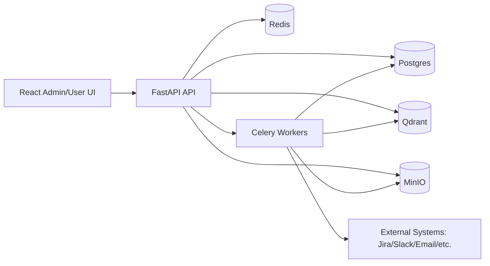

# CentraCortex Technical Design

## 1. Document Metadata

- Name: `CentraCortex Technical Design`
- Version: `1.0`
- Status: `Implemented Baseline`
- Last Updated: `2026-02-18`
- Scope: End-to-end system design for Modules 0-9

## 2. Purpose and Scope

This document defines the architecture and technical design of CentraCortex as a multi-tenant SaaS platform for enterprise knowledge ingestion, retrieval, secure chat, agent runtime, no-code agent building, and governance.

This design covers:

- Infrastructure and deployment topology
- Backend and frontend architecture
- Tenant isolation and authorization model
- Connector ingestion architecture
- Retrieval, chat, and agent execution architecture
- Builder versioning and deployment model
- Governance, audit, and security controls
- Operational and testing strategy

## 3. Goals and Non-Goals

### Goals

- Multi-tenant isolation from day 1 across API, DB rows, vector index, storage, and execution paths.
- Production-grade authentication, RBAC, groups, and ACL enforcement.
- Real connector ingestion into normalized document models.
- Hybrid retrieval with strict access filtering.
- Agentic runtime with approvals and full traces.
- No-code builder with strict spec schema, versioning, deploy, and rollback.
- Governance-ready auditability and hardening controls.

### Non-Goals

- Full enterprise SSO/OIDC implementation in this phase.
- Distributed global-scale orchestration tuning in this phase.
- Advanced OCR and multimodal agent capabilities in this phase.

## 4. Platform Stack

- Backend: FastAPI, SQLAlchemy, Alembic, Celery, Redis
- Datastores: Postgres, Qdrant, MinIO
- Frontend: React, TypeScript, Tailwind
- Runtime containerization: Docker Compose

## 5. High-Level Architecture

## 6. Multi-Tenant Isolation Design

Isolation is enforced at all critical boundaries:

- API layer: tenant context resolved from JWT tenant claim and/or `X-Tenant-ID`.
- Relational data: tenant-scoped rows and tenant checks in service and query layers.
- Vector index: one Qdrant collection per tenant (`tenant_<tenant_id>`).
- Object storage: tenant-scoped object key organization and metadata binding.
- Retrieval and tools: ACL checks enforce user/role/group access per tenant.

## 7. Core Backend Architecture

### 7.1 API Layer

- FastAPI routers by bounded context:
  - Auth/session
  - Tenant/user/profile
  - RBAC and policies
  - Connectors
  - Documents/indexing/retrieval
  - Chat
  - Agents runtime
  - Agent builder
  - Governance

### 7.2 Service Layer

- Business logic implemented in `app/services/*`.
- Services enforce tenancy and authorization before side effects.
- Service functions return domain-safe representations for API schema serialization.

### 7.3 Persistence Layer

- SQLAlchemy ORM entities in `app/models/*`.
- Alembic migrations define deterministic schema evolution.
- JSON columns used where flexible metadata is required (connector config, tool payloads, spec payloads, traces).

## 8. Data Model Overview

### 8.1 Identity and Access

- `users`, `tenants`, `tenant_memberships`
- `roles`, `user_role_assignments`
- `groups`, `group_memberships`
- `acl_policies` for document/tool/data-source access rules

### 8.2 Ingestion and Knowledge

- Connector config tables per source
- `documents` normalized source records
- `document_chunks` versioned chunks with embedding and ACL metadata
- Raw source artifacts in MinIO

### 8.3 Conversational and AI Runtime

- `llm_providers`, `llm_call_logs`
- `chat_conversations`, `chat_messages`, `chat_feedback`
- `agent_definitions`, `agent_runs`, `agent_trace_steps`, `tool_approvals`

### 8.4 Builder and Governance

- `agent_spec_versions`, `agent_style_examples`
- `audit_logs` for security and governance observability

## 9. Module-by-Module Design Summary

### Module 0 - Infrastructure Foundation

- Compose services: API, UI, worker, Postgres, Redis, Qdrant, MinIO.
- Request ID middleware and structured logs.
- Health probes and OpenAPI enabled.

### Module 1 - Auth and Tenant Context

- JWT access/refresh flow.
- Tenant switching with membership validation.
- Password reset with token lifecycle.

### Module 2 - RBAC, Groups, ACL

- Built-in and custom roles.
- Group assignment workflows.
- ACL policy evaluation integrated into retrieval and tool execution.

### Module 3 - LLM Provider Management

- Per-tenant provider config with encrypted secrets.
- Primary/fallback routing and rate controls.
- LLM call logging for usage and cost metadata.

### Module 4 - Connectors

- Dedicated connector subsystems and config schemas.
- Connection tests, sync state, scheduler integration.
- Normalized document mapping and ingestion ACL binding.

### Module 5 - Document Store and Indexing

- MinIO raw storage.
- Versioned chunking and reindex workflows.
- Hybrid retrieval substrate with Qdrant + SQL text ranking.

### Module 6 - Retrieval + Chat

- Hybrid search with ACL filtering before answer generation.
- Citations and conversation history.
- Prompt injection and exfiltration safety checks.

### Module 7 - Agent Runtime + Tools

- RouterAgent dispatch to knowledge/comms/ops/sql/guard.
- Tool schema checks, ACL checks, risky-action approvals.
- Execution traces and approval artifacts persisted.

### Module 8 - No-Code Agent Builder

- Prompt to strict `AgentSpec` generation.
- Style extraction and few-shot selection.
- Version lifecycle: draft, deploy, rollback, archive.
- Generated evaluation test suites per version.

### Module 9 - Governance + Security Hardening

- Audit log querying and CSV export.
- Governance approval queue UI/API.
- Rate-limiting middleware.
- Optional HMAC request-signing middleware.
- CSP and standard security response headers.

## 10. Security Design

### 10.1 Authentication and Session Security

- Short-lived access token, longer-lived refresh token.
- Token type checks and invalid token rejection.
- Password hashing with PBKDF2 and secret encryption with Fernet.

### 10.2 Authorization Model

- Tenant membership as baseline gate.
- Role + custom role + group aggregation.
- ACL policies with user/group/role matching.
- Enforcement applied in retrieval and tool execution paths.

### 10.3 Application Hardening

- Request IDs for traceability.
- Security headers including CSP.
- API rate limiting.
- Optional request signatures (`X-Signature`, `X-Signature-Timestamp`).
- Safety guardrails for prompt injection and data exfiltration patterns.

### 10.4 Secrets Management

- Design and operational guidelines in `docs/security-secrets.md`.
- Environment-based secret injection model for deploy-time configuration.

## 11. Reliability and Operations

- Synchronous APIs for control-plane operations.
- Asynchronous workers for sync/index/background work.
- Idempotent sync and versioned indexing patterns.
- Audit logging on privileged and security-relevant actions.

## 12. Observability and Governance

- Structured logs + request IDs.
- Audit records for admin, builder, runtime, and governance actions.
- Exportable audit CSV for compliance workflows.

## 13. Frontend Design

- Route-based admin application with module-specific pages.
- Dedicated pages for each major feature area.
- Tenant-aware API client layer passing auth and tenant headers.

## 14. Testing Strategy

- Backend integration tests across auth, RBAC, connectors, docs, chat, agent runtime, builder, governance.
- Frontend lint and smoke test routing.
- CI script validates backend lint/tests and frontend lint/tests.

## 15. Deployment Topology

- Local and staging: Docker Compose baseline.
- Production target:
  - API and workers as horizontally scalable services.
  - Managed Postgres/Redis/object/vector stores.
  - Externalized secrets manager.
  - CDN/WAF in front of UI and API gateway ingress.

## 16. Risks and Mitigations

- Risk: In-memory rate limiting is node-local.
  - Mitigation: move to Redis-backed distributed limiter in production.
- Risk: Optional request signing disabled by default for compatibility.
  - Mitigation: enable per environment and enforce client signing rollout.
- Risk: Builder-generated specs may drift from policy intent.
  - Mitigation: strict schema validation, generated tests, explicit deploy and rollback gates.

## 17. Future Enhancements

- OIDC/SAML SSO with SCIM provisioning.
- Distributed rate limiting and abuse analytics.
- Richer policy language and policy simulation mode.
- Advanced retrieval rerankers and semantic evaluation dashboards.
- Expanded agent safety policy DSL and runtime policy sandbox.
